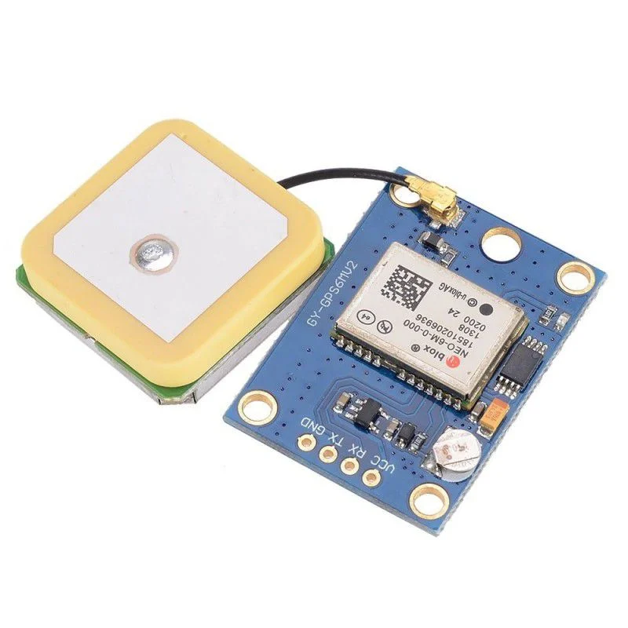
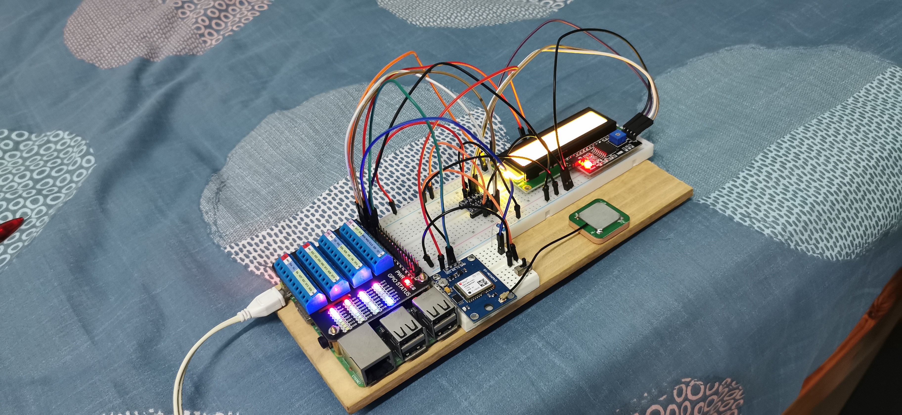
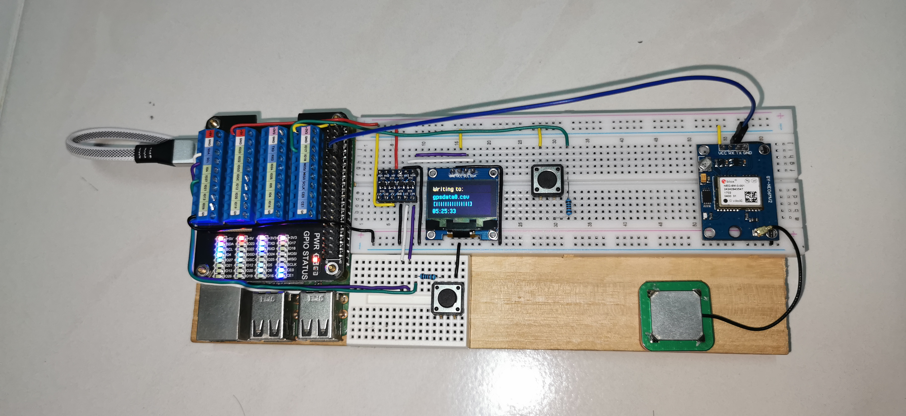
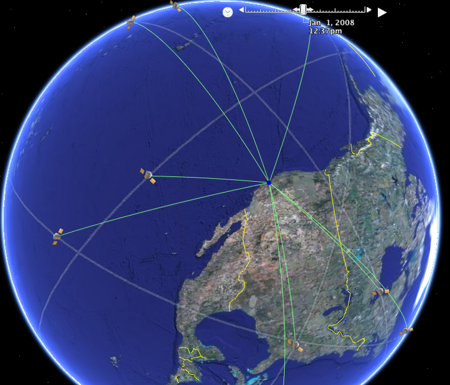

# Task 2 GPS Documentation

[[_TOC_]]

## Prototype Circuit
The initial testing for this task was done using a ublox Neo-6MV2 module and an external UFL ceramic antenna.
A popular choice amongst hobbyists, it requires relatively low power(100ma) while boasting a horizontal position accuracy of 2.5m[^1]

The first prototype was built using a Raspberry Pi 3b, a bi-directional logic level converter, an LCD module, and the GPS module. It was powered remotely with a 10000mAh powerbank on the underside of the prototype.

It was later rebuilt with a slimmer form factor to allow it to be more easily transported. The GPS module was also moved as far away from the other components as possible to reduce any possible interference.

## Global Positioning System

GPS works through a system of trilateration, where the global positioning system determines its location using distances or absolute measurements of time-of-flight from three or more sites/satellites. These satellite networks are maintained by different national agencies, who have collaborated to offer free use of their systems to the international community. This system of trilateration is the reason that optimal conditions for GPS usage involves wide angles of unrestricted view of the sky, as it allows the GPS to obtain a lock on as many satellite networks as possible. 

## NMEA Encoding

## Results

## Further Exploration

[^1]: https://content.u-blox.com/sites/default/files/products/documents/NEO-6_DataSheet_%28GPS.G6-HW-09005%29.pdf
