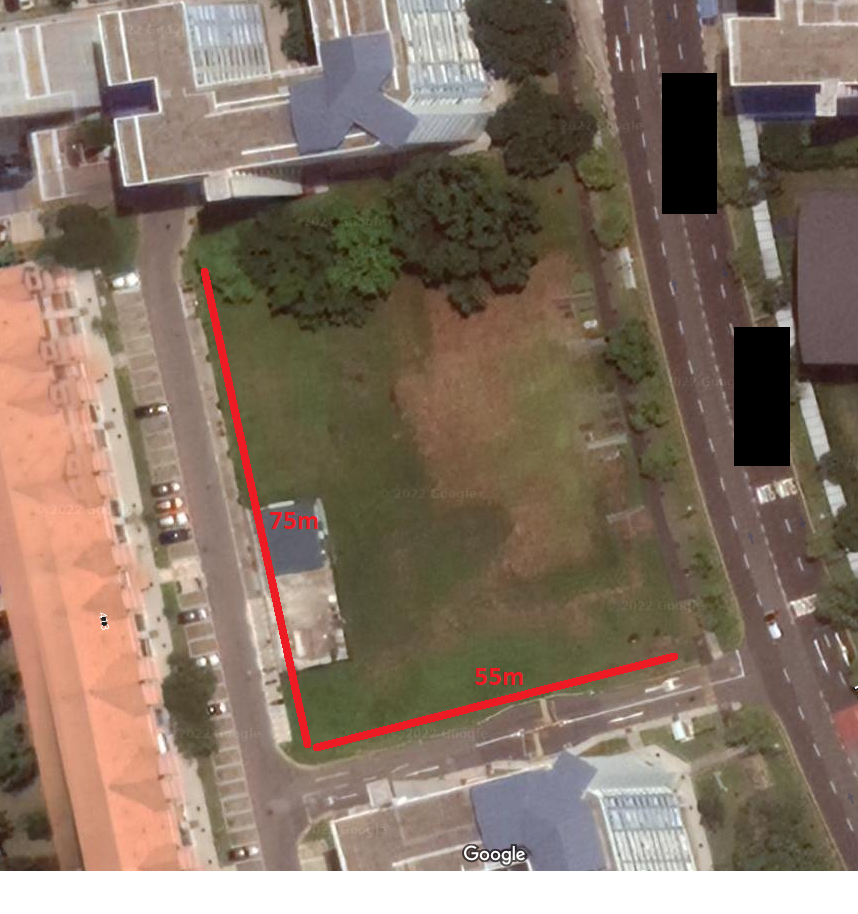
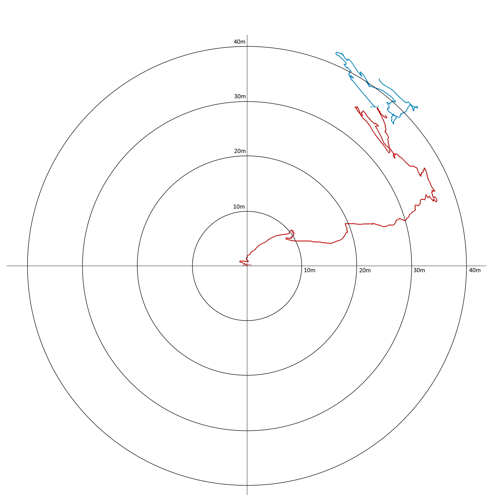
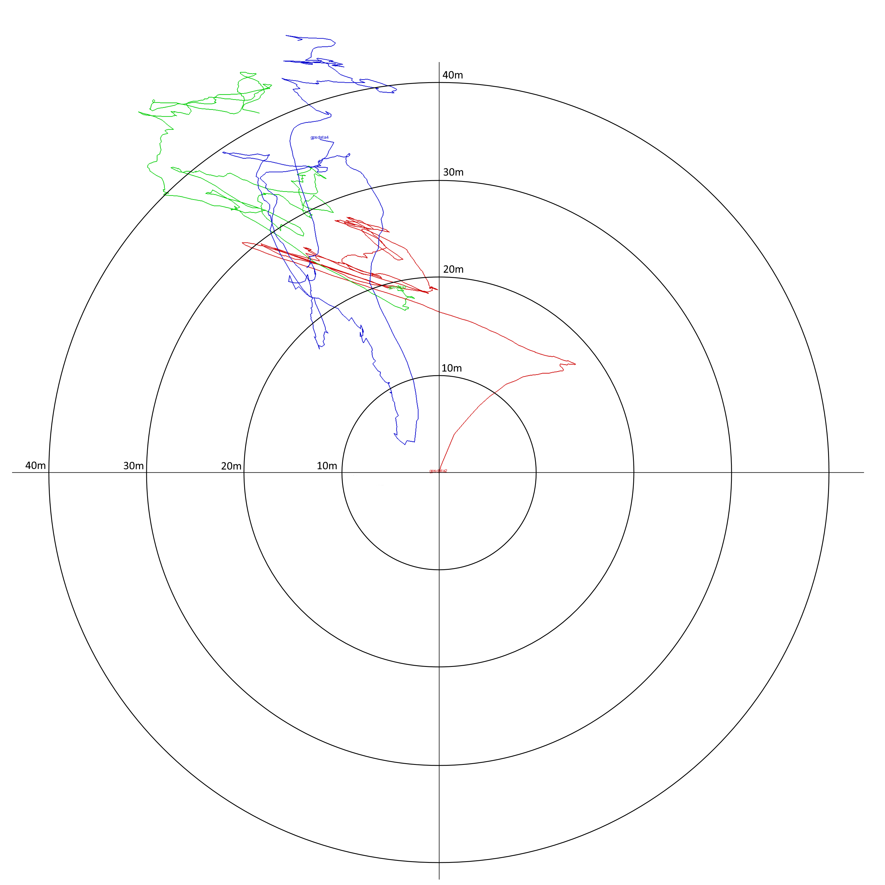
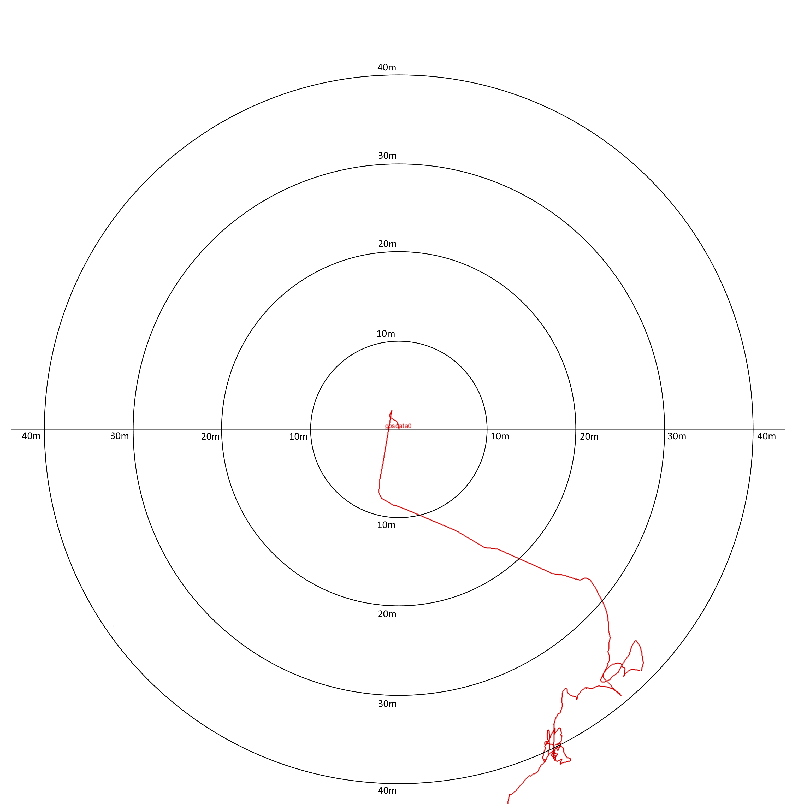
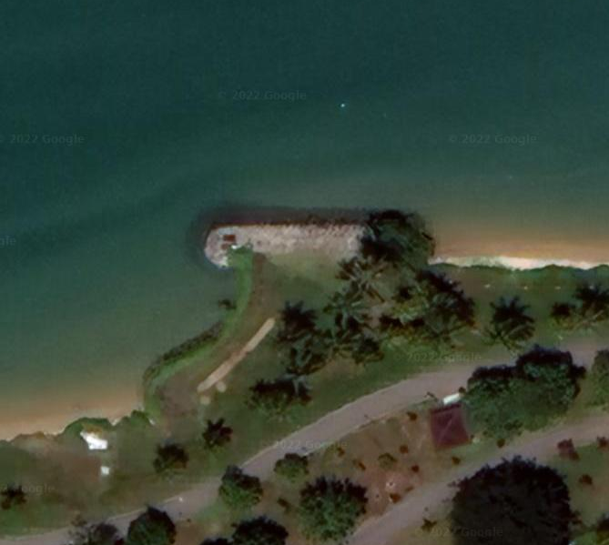
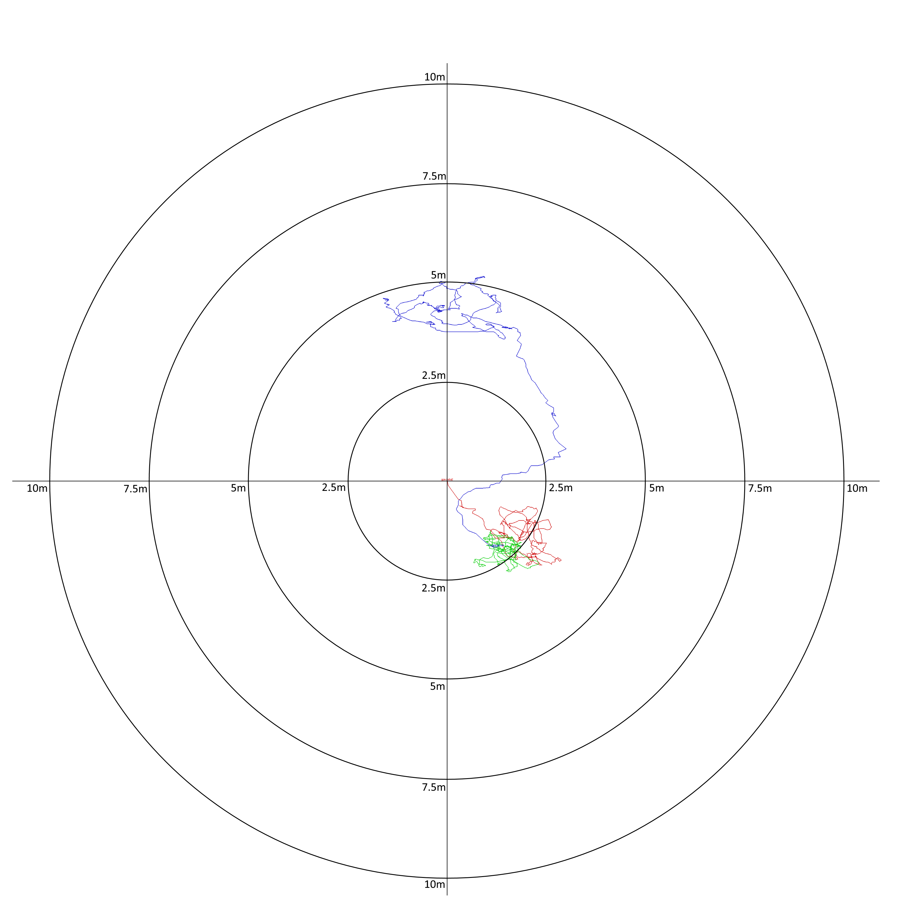
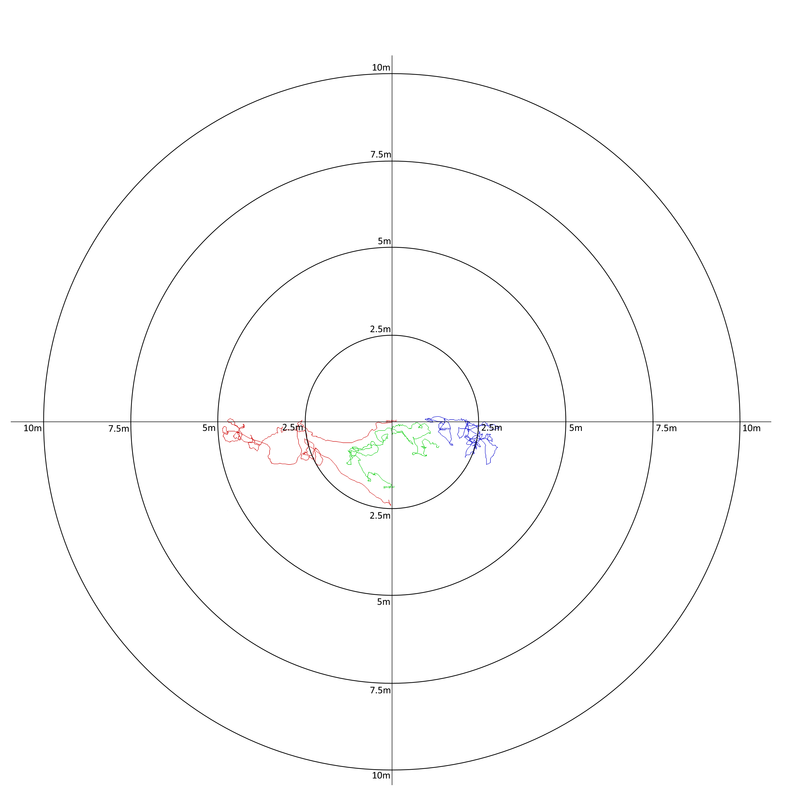

# Task 2 GPS Documentation

[[_TOC_]]

## Prototype Circuit
The initial testing for this task was done using a ublox Neo-6MV2 module and an external UFL ceramic antenna.
A popular choice amongst hobbyists, it requires relatively low power(100ma) while boasting a horizontal position accuracy of 2.5m[^1]

The first prototype was built using a Raspberry Pi 3b, a bi-directional logic level converter, an LCD module, and the GPS module. It was powered remotely with a 10000mAh powerbank on the underside of the prototype.

It was later rebuilt with a slimmer form factor to allow it to be more easily transported. The GPS module was also moved as far away from the other components as possible to reduce any possible interference.

## Global Positioning System

GPS works through a system of trilateration, where the global positioning system determines its location using distances or absolute measurements of time-of-flight from three or more sites/satellites. These satellite networks are maintained by different national agencies, who have collaborated to offer free use of their systems to the international community. This system of trilateration is the reason that optimal conditions for GPS usage involves wide angles of unrestricted view of the sky, as it allows the GPS to obtain a lock on as many satellite networks as possible. 

## NMEA Encoding

In context to a GPS, NMEA is a standard data format supported by all GPS manufacturers. It’s a protocol for GPS data that is used by the GPS receivers and associated software. The various NMEA data, or sentences, contain a wide variety of information that can be translated by GPS equipment into meaningful positioning/tracking/availability data. The ublox Neo-6MV2 module produces GSV, RMC, GSA, GGA, GLL, and VTG sentences, but for the purpose of this project we will primarily be focusing on:  

- GGA (Global Positioning System Fix Data) 
- GSA (GPS DOP and active satellites )
- GSV (GPS Satellites in view)

From these sentences we can retrieve Latitude and Longitude, as well as get a possible measure of accuracy by looking at satellites the module is connected to (NoSV), and the precision metrics (dilution of precision).

## Results
As a criteria for testing locations, wide open areas with a good viewing angle of the sky were selected. The testing device was then placed on the ground for a period of 20-30 minutes, and the data recorded to check for drift. For the first test location, an open field was used, and the device placed in the centre of the field.

Test 1  

Conditions: Clear Sky, 7pm. Recorded for 20 minutes.

Notes: Huge amount of drift (35m) occuring mostly in the first 10 minutes. Although the next 10 minutes appeared more stable, drift is still significant (10m) compared to advertised accuracy. A decision was made for future tests to last a longer time to assess how active duration affected accuracy.

Test 2

Conditions: Cloudy Sky, 7pm. Recorded for 30 minutes.

Notes: Significant drift (40m) still observed. Duration does not appear to consistently settle as time goes by.

Test 3

Conditions: Cloudy Sky, 7pm. Recorded for 30 minutes.

Notes: Extremely significant drift (50m) observed in the first 10 minutes. Drift reduced as time passed, but is still very significant (30m over 20 minutes).

Despite extensive troubleshooting, the margin of error seemed to be far too significant to be normal. A second location was selected at a beach far away from possible interference.

Test 4

Conditions: Clear Sky, 10am. Recorded for 30 minutes.

Notes: Observed significantly less drift in this test. It is postulated that there may have possibly been a big sort of electrical interference running underneath the previous location. Although greater drift occurred in the last 10 minutes, the first 20 minutes observed accuracy very close to advertised values.

Test 5

Conditions: Cloudy Sky, 7pm. Recorded for 30 minutes.

Notes: Observed slightly more drift in the first 10 minutes, with the later 20 minutes being relatively stable.

## Further Exploration

- ublox maximum performance mode
- ublox m8n + external 25dbi antenna
- drift compared against (noSV) and (DOP) data
- discarding anomalous positional data

[^1]: https://content.u-blox.com/sites/default/files/products/documents/NEO-6_DataSheet_%28GPS.G6-HW-09005%29.pdf
