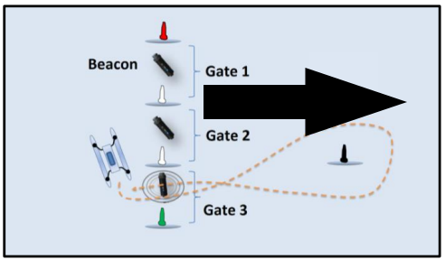
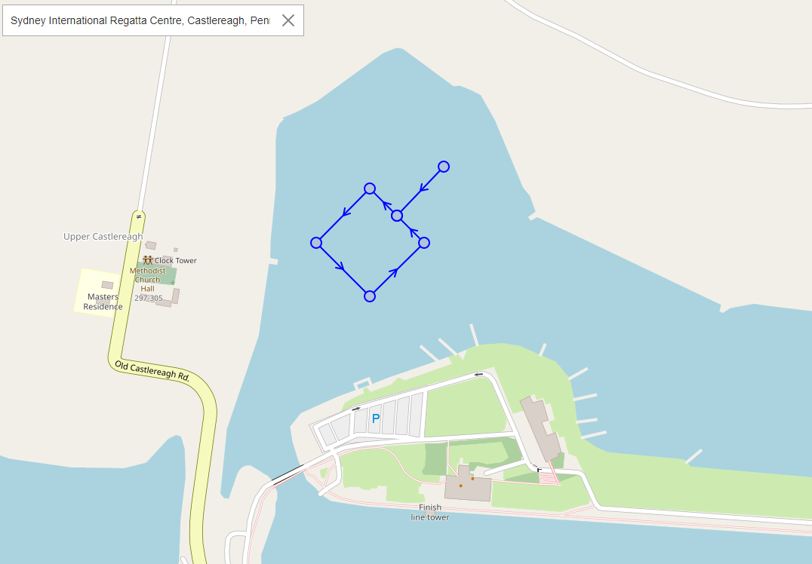
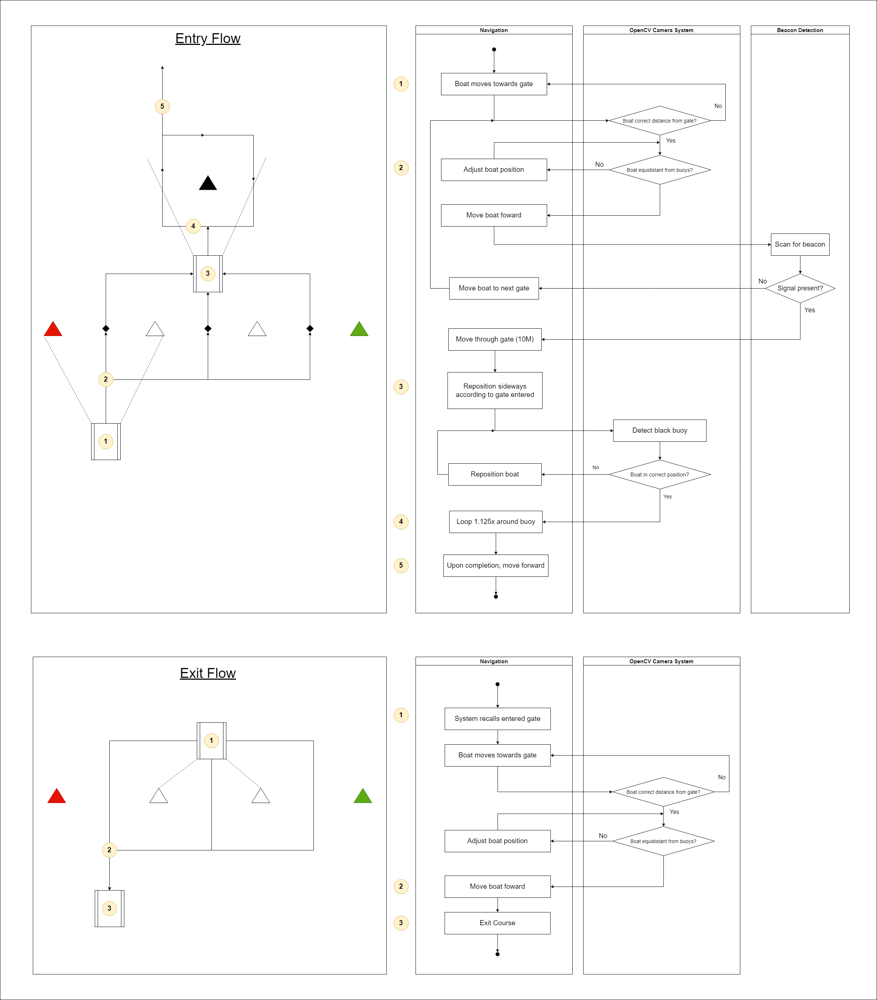

# README
1. [GPS_Module.py](#GPS_Module.py)
2. [Navigation.py](#Navigation.py)
3. [Task2.py](#Task2.py)

## GPS_Module.py
This script gets the serial output from the USB GPS module ('/dev/ttyACM0') and converts it into decimal degrees and then transmits it across the CAN bus.
During initialisation, the possibility of corrupted text data in the first few messages exists, but exceptions are there to disregard them.

# Usage
Relatively straightforward, should simply be constantly running on the pi.
Log location and captured NMEA sentence type can be adjusted (mostly for capture/debugging purposes).

## Navigation.py
This module contains the necessary movement commands to be used in the execution of Task 2. It listens to the GPS module, the Nav Module (for heading), and itself on the CAN Bus. Tolerance values (how close the program needs to run to its parameters) can be adjusted at the top.

### Noteable variables:
**LAT/LON METER**: The GPS decimal equivalent of a meter at this part of the world. True calculation of this value is actually more complicated due to Longitude-to-meter conversion changing based on latitude, but this works in a pinch. A more advanced method using the Haversine formula is present in the get_distance_between() function. This has been calibrated to a fairly high degree of accuracy to the competition gps location.

**Rotational/Distance Tolerance**: Since there is little chance for a boat to accurately stop on a dime, these values are used to give the formulas some tolernace +/- in calculations. It's hard to know exactly what's an acceptable level of tolerance for the boat to not be infinitely adjusting its position, while still remaining fairly accurate. If increased, the boat movement calculations will be less precise, but might more realistically account for the boat's dimensions/movement. However, if increased too far, will cause the calculations to be wildly inaccurate.

**NORTHBOUND**: This value is the 'relative' north alignment for this task. It should be pointed towards the "end" of the course, in the direction perpendicular to the gates. In task2.py this is set at the start of the enter_course() function to automatically be the direction the boat is facing when the command to start the task is given. This means that the boat must be properly aligned before commencing the task. This can also be set manually, in task2.py. 

This is the heading NORTHBOUND should be set as. Important to note that it may not be heading 0 depending if the course is rotated. In this example, NORTHBOUND should be 90.

### Notes on functions:

**heading_calculator()**: Used to easily calculation addition and subtraction to heading since heading values are only from 0-360.

**get_distance_between()**: Uses the Haversine formula to calculate the distance between two given GPS coordinates.

**move_boat()**: This is primarily used by the other movement functions to send a command on the CAN bus to move. Should generally not be used on its own because there is no check for when the movement is complete. So multiple chained move_boat() commands might end up all executing in rapid succession.

**move_boat_to_coordinate()**: Loops until the boat is at the given coordinates (+/- tolerance values). Uses atan2() to determine the vector angle from the current coordinates to the target coordinates, and then aligns the boat in that direction. The distance between the current point and the target point is then calculated, and a move_boat() command is sent to the CAN bus with a *power_scaling* based on how far away the target point is. This may have to be tweaked depending on how powerful the engine actually is. 

**move_boat_by_distance()**: This function is primarily used to get the boat to turn and move a specific distance left or right. It uses trigonometry to convert between polar and Cartesian coordinates. This allows it to calculate the coordinates of the target point (n) meters to its left or right regardless of its heading. It then calls the move_boat_to_coordinate() function to get there. This function allows the boat to theoretically navigate the course if all the distances between objects are known, without having to obtain the coordinates manually and moving it from coordinate to coordinate. This allows the boat to calculate the coordinates to do this:

 while only having the coordinates of the start location. Note: this relies on the NORTHBOUND attribute being relatively accurate.

**align_heading()**: Used to align the boat to a specific heading before carrying out movement. Turns boat clockwise at power (0.1) until the target heading (within tolerance) is reached. Power may have to be manually adjusted. 

**hold_position()**: Mostly a legacy function, not really used since the concept was largely abandoned during development. It should technically work, but has to be put in an external loop and given the coordinates of the position to hold. You can use Navigation.get_location() to get the coordinates to hold at before you start the loop.

## Task2.py
Thie script is used to carry out the logic for Task 2. Listens for a signal to begin, and then goes into enter_course(), since the discussion with client was for the boat to exit the gate immediately after, exit_course() is called immediately after. The internal logic from the flow chart is preserved in the comments. 

Flow Diagram:

### Usage
Relatively straightforward, should simply be constantly running on the pi.
NORTHBOUND variable would likely be set in `Navigation.NORTHBOUND = ` here if set manually.

